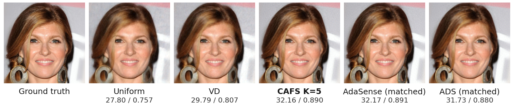
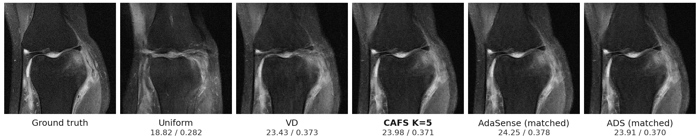

# CAFS

Consistency Model-based Adaptive Fourier Sensing, accompanying
**Fast Adaptive Fourier Sensing with Consistency Models**.
Maintained by [hanwangsgit](https://github.com/hanwangsgit).

CAFS alternates a corrected few-step consistency-model estimate with Fourier
energy ranking. The implementation includes CelebA-HQ and single-coil fastMRI,
matched AdaSense/ADS selectors, and the paper's fixed sampling baselines.

## Results

At 10% sampling, five-step CAFS reduces median sensing time relative to matched
AdaSense by **1.22× on CelebA-HQ** and **24.24× on fastMRI**.

**Table 1. Sensing efficiency over five acquisition rounds.**

| Method | NFEs | CelebA-HQ peak GPU (GiB) | CelebA-HQ time (s) | fastMRI peak GPU (GiB) | fastMRI time (s) |
|---|---:|---:|---:|---:|---:|
| Uniform | 0 | 0.864 | 1.041 | 0.506 | 0.027 |
| VD | 0 | 0.867 | 1.229 | 0.510 | 0.014 |
| CAFS K=1 | 5 | 1.242 | 9.557 | 1.131 | 0.177 |
| **CAFS K=5** | 25 | 1.244 | 9.819 | 1.135 | 0.823 |
| CAFS K=10 | 50 | 1.244 | 10.442 | 1.135 | 1.632 |
| AdaSense (matched) | 1,000 | 3.672 | 12.008 | 5.574 | 19.952 |
| ADS (matched) | 80,032 | 33.823 | 860.255 | 29.073 | 2,335.080 |

Times exclude setup and final reconstruction and are medians at 10% sampling on
an NVIDIA A100-SXM4 (80 GB), over 9 face images and 24 MRI volumes. Peak memory is
the maximum allocated memory over all 30 cases, three budgets, and recorded GPU
types. NFEs count sample-level forward and backward evaluations. AdaSense and ADS
are matched selection adapters; face ADS adapts the MRI settings.

**Mean reconstruction quality at 10% sampling (30 cases per dataset).**

| Method | CelebA-HQ PSNR / SSIM | fastMRI PSNR / SSIM |
|---|---:|---:|
| Uniform | 28.34 / 0.757 | 20.47 / 0.383 |
| VD | 30.35 / 0.808 | 25.66 / 0.493 |
| CAFS K=1 | 32.73 / 0.883 | 25.09 / 0.471 |
| **CAFS K=5** | 33.45 / 0.899 | 25.46 / 0.479 |
| CAFS K=10 | 33.48 / 0.900 | 25.49 / 0.480 |
| AdaSense (matched) | 33.83 / 0.908 | 26.13 / 0.495 |
| ADS (matched) | 33.05 / 0.892 | 25.63 / 0.482 |

PSNR is in dB. Faces use 20-step DDRM; MRI uses 10-step corrected CM.
Full 5%, 10%, and 25% results are in [paper_metrics.csv](reproduction/paper_metrics.csv).

**Figure 2. CelebA-HQ reconstruction at 10% sampling.**



Image `celeba-hq:1257`, with a shared 20-step DDRM final reconstructor.
Labels show PSNR (dB) / SSIM.

**Figure 3. fastMRI reconstruction at 10% sampling.**



Volume `file1002145.h5`, slice 19, with a shared 10-step corrected CM final
reconstructor. Images show the central 320×320 magnitude crop; labels show
PSNR (dB) / SSIM.

Both figures are selected favorable CAFS examples and use a common display scale
within each panel. Aggregate quality over all 30 cases per dataset at 5%, 10%,
and 25% sampling is available in [the quality tables](reproduction/paper_metrics.csv).

## Verify the reported results

Recompute the tables directly from the included per-case measurements:

```sh
git clone https://github.com/hanwangsgit/cafs.git
cd cafs
python3 verify_results.py > verified-results.json
```

This uses only Python's standard library. It reads all 1,440 recorded measurements
from [paper_runs.csv](reproduction/paper_runs.csv), checks the complete case grid,
and reproduces the 42 quality and 14 efficiency rows at their reported precision.
No datasets, checkpoints, PyTorch installation, or model execution are needed.

## Run CAFS on a case

Use Python 3.10. For Linux with an NVIDIA GPU:

```sh
python3.10 -m venv .venv
. .venv/bin/activate
python -m pip install -r requirements-cuda.txt
```

This profile uses PyTorch 2.5.1 with CUDA 12.1, matching the recorded experiments.
`requirements.txt` provides the environment used for the completed CPU checks.
The remaining package versions and validation scope are documented in
[REPRODUCIBILITY.md](REPRODUCIBILITY.md).

Follow [CHECKPOINTS.md](CHECKPOINTS.md) to download the weights and pinned face
architecture. For the face example, prepare the images and run:

```sh
python prepare_data.py --output data/celeba
python run.py --domain face --data-root data/celeba \
  --architecture checkpoints/ddpm-celebahq-256 \
  --student checkpoints/face_cm.pt --teacher checkpoints/face_teacher.pt \
  --index 8 --budget 0.1 --policies cm_spectral_repeat_k5 \
  --output results/face-example
```

For MRI, obtain the single-coil knee validation files listed in
`reproduction/mri_samples.json` through [fastMRI](https://fastmri.med.nyu.edu/),
place them under `data/singlecoil_val/`, then run:

```sh
python run.py --domain mri --data-root data/singlecoil_val \
  --student checkpoints/mri_cm.pt --teacher checkpoints/fmri.ckpt \
  --index 16 --budget 0.1 --policies cm_spectral_repeat_k5 \
  --output results/mri-example
```

These select the cases displayed above. The paper protocol targets CUDA;
`--device cpu` is available for local use with a device-specific random stream.

## Full experiment grid

Omit `--index`, `--budget`, and `--policies` from a case command to run all
30 cases × 3 budgets × 8 methods, including the one-shot ablation. Use a new output
directory per invocation. The full matched ADS panel used up to about 34 GiB
allocated GPU memory. Generate summaries with:

```sh
python summarize.py results/face > results/face-quality.csv
python summarize.py results/mri > results/mri-quality.csv
python summarize.py results/mri --efficiency > results/mri-efficiency.csv
```

Replace `results/face` and `results/mri` with your chosen output directories.
Records include masks, reconstructions, quality metrics, seeds, sensing NFEs,
timing, and peak allocated memory.

## Method and provenance

`cafs/reconstruction.py` predicts and corrects images; `cafs/policies.py` ranks
complete Fourier groups; `cafs/experiment.py` binds the paper's settings and RNG
streams. [REPRODUCIBILITY.md](REPRODUCIBILITY.md) records preprocessing, matched
baseline adaptations, timing scope, and the verification performed on this release.

Original CAFS code is [MIT licensed](LICENSE). Checkpoints are available at the
[maintainer's Google Drive location](https://drive.google.com/drive/folders/1q_Hop4FCYnTJLEMBuSYFL6_cPjVjTo3p).
Their upstream terms are listed in [CHECKPOINT_NOTICE.md](CHECKPOINT_NOTICE.md);
code attribution is in [THIRD_PARTY.md](THIRD_PARTY.md).
